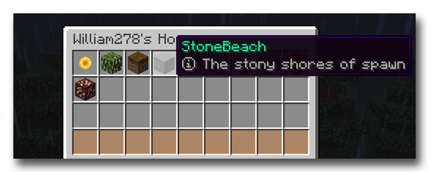

# 
[

**HuskHomesGUI** is a GUI add-on plugin for [HuskHomes v3.x](https://github.com/WiIIiam278/HuskHomes2) on Spigot servers. It provides a chest-style graphical user interface (GUI) for browsing home and warp lists. It replaces the chat menu system that is built into HuskHomes when you type `/homelist`, `/phomelist` or `/warplist`.

If you prefer to browse using a menu, or would like better support for Bedrock players connecting over Geyser, then this add-on is for you.

## Instructions
### Setup
1. Have HuskHomes v3.x installed on your server(s)
2. Download HuskHomesGUI and place it in your server's `plugins` folder

### Usage
Simply use the list commands you are familiar with to bring up a list of homes or warps.
Then you can left-click to teleport to a home/warp, right click to edit it, and shift-left click to change the icon of the home in the list to match the type of item in your main hand. Use the page navigation buttons to switch pages.